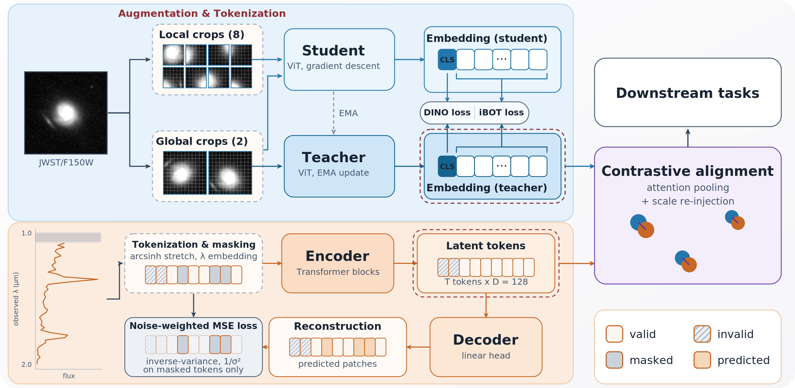

# SSL OutThere — self-supervised multimodal learning on JWST imaging and spectra

<sub>Code for the NeurIPS **Representations for the Physical Sciences** workshop paper. This branch is the snapshot the paper was produced from: `git checkout neurips2026`.</sub>

This repository contains the code necessary to reproduce the results of the paper on an HPC system: the data-preparation pipeline, both self-supervised encoders, the CLIP alignment, and the notebooks that generate every figure and table.



---

## Hardware

Everything lives under the repository root — data, checkpoints and figures are all git-ignored, and should be produced in the repository when running the scripts. The total estimated space to perform the full training and analysis is **~400 GB**.

The image encoder was trained on **20 A100 GPUs (5 nodes x 4)**. The spectrum encoder, the CLIP alignment and all downstream probes were trained on **a single H100 GPU**. We have not tested other configurations.

---

## Installation

Environments are managed with an open-source environment manager [pixi](https://pixi.sh). Prerequisites: Linux x86-64, an NVIDIA GPU + latest driver, pixi.

```bash
pixi install                 # create the environment
pixi run register-kernel     # Jupyter kernel "ssl_outthere (pixi)" for the notebooks
```

`default` (torch 2.5.1+cu124) runs everything in this repository; `dev` adds `black` and `isort`. Prefix any command with `pixi run` to execute it inside the environment, or use `pixi shell`.

---

## Repository layout

| Path |  |
|------|------------|
| `data/survey/` | generate per survey, the DJA spectrum catalog, sky-noise measurement, and the image-spectrum crossmatch |
| `encoder_image/jwst_dino/` | Image encoder: DINOv2/iBOT ViT for single-channel Imaging |
| `encoder_spectrum/LowResPT/` | Spectrum encoder: masked-autoencoder transformer on PRISM spectra |
| `encoder_fusion/` | CLIP alignment of the two frozen models |
| `neurips/` | Notebooks to produce every figure and table |

---

## Data preparation

Run everything from the repository root. All of the computed intermediate file, training data and outputs are written in the repository.

### 1 — Image cutouts

Each survey has its own deticated data cutout script and converts all four into the same on-disk format (`data/image/f150w/*.npy` plus `data/image/image_index_<survey>_f150w.fits`), so the encoder loads them identically.

#### [COSMOS-Web](https://cosmos.astro.caltech.edu/page/cosmosweb)

The F150W 30 mas mosaics are served as plain files, one per tile (20 tiles, A1--A10 and B1--B10, ~1.7 GB each) or as a single tarball of all of them (~33 GB):

```bash
CW=https://cosmos2025.iap.fr/data/nircam
mkdir -p data/survey/cosmos_2025/f150w

# either: all 20 tiles in one archive
curl -L -o cw_f150w.tar.gz $CW/mosaic_nircam_f150w_COSMOS-Web_30mas_all_v1.0_sci.tar.gz
tar -xzf cw_f150w.tar.gz -C data/survey/cosmos_2025/f150w

# or: tile by tile
for T in A1 A2 A3 A4 A5 A6 A7 A8 A9 A10 B1 B2 B3 B4 B5 B6 B7 B8 B9 B10; do
    M=mosaic_nircam_f150w_COSMOS-Web_30mas_${T}_v1.0_sci.fits.gz
    curl -L -o data/survey/cosmos_2025/f150w/$M $CW/extensions/$M
done
gunzip data/survey/cosmos_2025/f150w/*.gz
```

**Note**: The master catalog and the detection segmentation maps sit behind a registration page at <https://cosmos2025.iap.fr/catalog_download.php>. Even the catalog URLs carry directly the registration credentials, we deliberately exclude them for respectful use — please register with the survey yourself and fill them in.

```bash
read -p 'COSMOS-Web user: ' CWUSER          # both from the registration form above
read -s -p 'COSMOS-Web password: ' CWPASS; echo
CAT=https://cosmos2025.iap.fr/data/catalog
mkdir -p data/survey/cosmos_2025/segmentation_maps

curl -u "$CWUSER:$CWPASS" -L -o data/survey/cosmos_2025/COSMOSWeb_mastercatalog_v1_photom_primary.fits \
    $CAT/COSMOSWeb_mastercatalog_v1_photom_primary.fits

for T in A1 A2 A3 A4 A5 A6 A7 A8 A9 A10 B1 B2 B3 B4 B5 B6 B7 B8 B9 B10; do
    S=detection_chi2pos_SWLW_${T}_segmap_v1.3.fits.gz
    curl -u "$CWUSER:$CWPASS" -L -o data/survey/cosmos_2025/segmentation_maps/$S \
        $CAT/segmentation_maps/$S
done
```

With the mosaics, the catalog and the segmentation maps in place, export the cutouts:

```bash
python data/survey/cosmos_2025/cutout_export_npy.py \
    --catalog data/survey/cosmos_2025/COSMOSWeb_mastercatalog_v1_photom_primary.fits \
    --filters f150w --base-dir data/survey/cosmos_2025 --output-dir data/image
```

#### [CEERS](https://ceers.github.io/)

```bash
CEERS=https://web.corral.tacc.utexas.edu/ceersdata/DR1
wget -P data/survey/CEERS $CEERS/Catalog/ceers_cat_v1.0.fits.gz
wget -P data/survey/CEERS $CEERS/Catalog/ceers_segmap_v1.0.fits.gz
wget -P data/survey/CEERS $CEERS/NIRCam/fullceers/hlsp_ceers_jwst_nircam_fullceers_f150w_v1_sci-bkgsub.fits.gz
gunzip data/survey/CEERS/*.gz

python data/survey/CEERS/cutout_export_ceers.py \
    --catalog data/survey/CEERS/ceers_cat_v1.0.fits \
    --mosaic  data/survey/CEERS/hlsp_ceers_jwst_nircam_fullceers_f150w_v1_sci-bkgsub.fits \
    --segmap  data/survey/CEERS/ceers_segmap_v1.0.fits --output-dir data/image
```

#### [JADES](https://jades-survey.github.io/)

Two fields, GOODS-S and GOODS-N, each contributing a mosaic, a segmentation map and a photometry catalog. The exporter reads both from one directory.

```bash
JADES=https://slate.ucsc.edu/~brant/jades-dr5
for F in GOODS-S GOODS-N; do
    f=$(echo $F | tr 'A-Z' 'a-z')
    wget -P data/survey/JADES $JADES/$F/hlsp/images/mosaics/hlsp_jades_jwst_nircam_${f}_f150w_v5.0_drz.fits
    wget -P data/survey/JADES $JADES/$F/hlsp/images/mosaics/hlsp_jades_jwst_nircam_${f}_segmentation_v5.0_drz.fits
    wget -P data/survey/JADES $JADES/$F/hlsp/catalogs/hlsp_jades_jwst_nircam_${f}_photometry_v5.0_catalog.fits
done

python data/survey/JADES/cutout_export_jades.py \
    --jades-dir data/survey/JADES --output-dir data/image
```

#### [OutThere](https://github.com/OutThere-JWST)

The OutThere pure-parallel survey is still undergoing extensive reduction. The data will become available together with the survey data release soon; the exporter below is included so the pipeline is complete, and it expects the per-field `grizli` drizzles, SExtractor catalogs and IR segmentation maps under `data/survey/OutThere/imaging/`.

```bash
python data/survey/OutThere/cutout_export_outthere.py \
    --imaging-dir data/survey/OutThere/imaging --output-dir data/image
```

### 2 — Sky noise

The noise augmentation levels the four surveys onto a common floor and needs a measured background sigma per field:

```bash
python data/survey/CEERS/measure_sky_sigma.py
python data/survey/JADES/measure_sky_sigma.py
python data/survey/OutThere/measure_sky_sigma.py
python data/survey/cosmos_2025/measure_sky_sigma_per_tile.py
```

The printed values will populate `SKY_SIGMA` in `encoder_image/jwst_dino/data/augmentations.py`.

### 3 — Spectra

The DAWN JWST Archive publishes the NIRSpec emission-line catalog and the combined PRISM spectra on one shared 473-pixel wavelength grid. Merge them into the single FITS the rest of the pipeline reads:

```bash
DJA=https://s3.amazonaws.com/msaexp-nirspec/extractions
wget -P data/survey/DJA $DJA/dja_msaexp_emission_lines_v4.5.csv.gz
wget -P data/survey/DJA $DJA/dja_msaexp_emission_lines_v4.5.prism_spectra.fits
gunzip data/survey/DJA/dja_msaexp_emission_lines_v4.5.csv.gz

python data/survey/DJA/build_dja_spectra_catalog.py \
    --csv  data/survey/DJA/dja_msaexp_emission_lines_v4.5.csv \
    --spec data/survey/DJA/dja_msaexp_emission_lines_v4.5.prism_spectra.fits \
    --out  data/spectrum/DJA_spectra_v4.5.fits
```

### 4 — Crossmatch and paired embeddings

Both scripts take no arguments; all paths are repository-relative.

```bash
python data/survey/crossmatch/build_crossmatch.py     # -> data/crossmatched/dja_x_f150w.fits
python data/survey/crossmatch/compute_embeddings.py   # -> data/crossmatched/embeddings_f150w.h5
```

> `compute_embeddings.py` runs **both pre-trained encoders**, so the order is: steps 1-3 -> pre-train the image and spectrum encoders -> step 4 -> CLIP fusion. The checkpoints it loads are set at the top of the script.

---

## Pre-training

All three models use the same LightningCLI entry point.

```bash
# Image encoder
cd encoder_image/jwst_dino
python trainer.py fit --config jwst_dino.yaml
python trainer.py fit --config jwst_dino.yaml --trainer.devices=4 --trainer.num_nodes=5
#   multi-node SLURM launchers: sbatch/train_dev.sh, sbatch/train_distribute.sh

# Spectrum encoder
cd encoder_spectrum/LowResPT
python trainer.py fit --config low_res_pt.yaml
#   hyperparameter search: optuna/launch_study.py (see optuna/README.md)

# CLIP fusion — requires data/crossmatched/embeddings_f150w.h5
cd encoder_fusion
python trainer.py fit --config config_dja.yaml
```

Outputs land in each module's `outputs/<run>/version_*/checkpoints/`.

---

## Reproducing the paper

Every figure and table comes from a notebook in `neurips/`. They share `plotstyle.py`, which resolves all paths from the repository root, so they run unmodified after a clone as long as the inputs below exist.

| Notebook | Produces | Inputs |
|---|---|---|
| `neurips_mass_bench.ipynb` | Figure 2, Table 1 | `DJA_spectra_v4.5.fits`, `embeddings_f150w.h5`, fusion checkpoint |
| `neurips_qualitative_bench.ipynb` | Figure 3 | cutout store, `dja_x_f150w.fits`, image + spectrum checkpoints |
| `neurips_image_bench.ipynb` | Figure 4 | cutout store, COSMOS-Web photometry catalog, image checkpoint |
| `neurips_spectrum_bench.ipynb` | Figure 5 | `DJA_spectra_v4.5.fits`, spectrum checkpoint |
| `neurips_probe_breakdown.ipynb` | Figure 6 | `DJA_spectra_v4.5.fits`, `embeddings_f150w.h5`, fusion checkpoint |


---

## License & citation

MIT (see `LICENSE`). Author: Yang Cheng. Repo: <https://github.com/2003cy/ssl_outthere>.

The image encoder is derived from [AstroCLIP](https://github.com/PolymathicAI/AstroCLIP)'s adaptation of [DINOv2](https://github.com/facebookresearch/dinov2) — please credit those works when using it.
